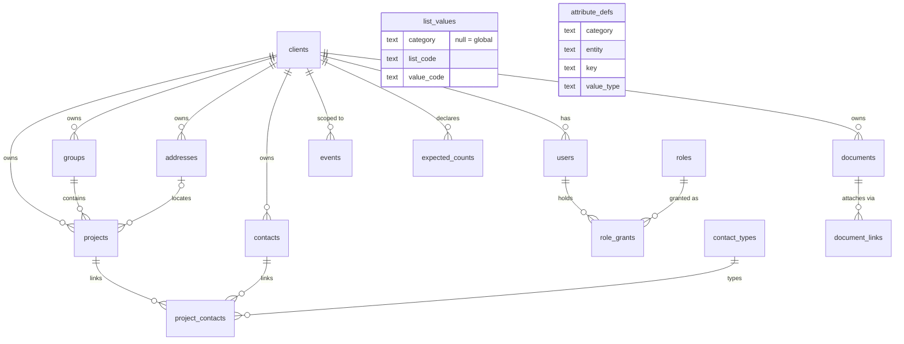

# kg-core — Core Data Model

*The category-agnostic record engine for The Knowledge Gardens. From-scratch rebuild decided 2026-06-30 (founder + Rich, systems architect). The old BKG app (`~/Developer/bkg`) is frozen and is not a dependency.*

## The shape

One engine, many categories. A **client** (tenant) owns **groups** (containers: a building, a portfolio, a campus) and **projects** (units of work). **Contacts** — people, orgs, *and machine agents* — attach to projects through typed, time-bounded **project_contacts**. **Documents** attach to anything via **document_links**. Everything an actor does lands in the append-only **events** log. **expected_counts** is the reconciliation contract: what the client says should exist vs. what does.

(`list_values` and `attribute_defs` are platform vocabularies — they constrain values and describe `attrs` keys but carry no FKs into tenant data. `role_grants.scope_id` points at a client, group, or project depending on `scope_type`.)

## The category rule

Core tables are **category-agnostic**. "Category" (property management, construction, …) appears in exactly three places, all vocabularies:

1. `list_values.category` — which controlled-vocabulary values a category sees (null = global).
2. `contact_types.category` — which contact roles a category offers (e.g. `lessee` is `property`-only; `vendor` is global).
3. `attribute_defs.category` — which `attrs` jsonb keys a category defines, on which entity.

Category-specific *data* lives in `attrs` jsonb on groups/projects, described by `attribute_defs`. Category-specific *behavior* lives above the engine, never inside it.

## The Rubicon Rule

**Any proposal to add a category-specific attribute — a column, a check constraint, a branch on `clients.kind` — stops for a design conversation before build.** No exceptions, including "it's just one column." The failure mode this prevents is the old BKG app: a general-purpose engine that quietly became a construction app. If the conversation concludes the attribute is legitimate, it lands as an `attribute_defs` row + `attrs` key, or as a deliberately-designed new table — never as a silent widening of a core table.

## Access model

- Identity: Auth0. The JWT `sub` claim maps to `users.auth0_sub`; `current_client_id()` derives the tenant. All RLS helpers read `request.jwt.claims` directly, so they behave identically on hosted Supabase and plain local Postgres.
- Roles (rank order): `read_only < editor < admin < super_admin`. `super_admin` = operator, bypasses client scoping.
- `role_grants` scope to a client, group, or project. Policy pattern everywhere: *(row's client = caller's client AND a grant covers the row's scope) OR operator*. Writes require editor+.
- **v0 leniency (documented deliberately):** for client-level tables that carry no group/project on the row (contacts, addresses, documents…), *any* grant inside the client covers the row — a project-scoped read_only user can read client-wide contacts. Tighten per-table as rows gain scope columns.
- Documents add two more gates: `min_role_visibility` (rank floor per row) and `role_grants.module_visibility` (per-grant jsonb; `{"budgets": false}` hides `doc_type='budgets'` rows even from sufficient rank). Write policies are split per verb so a permissive `FOR ALL` policy can never OR-in SELECT visibility (this exact leak was caught by test 04).
- `events` is append-only: insert-only policies AND no UPDATE/DELETE privileges granted.

## Reconciliation

`expected_counts(client_id, entity, expected, as_of)` is the trust loop: during onboarding the client states how many projects/contacts/etc. should exist; the recon query (test 03) compares against actuals. Drift is a first-class signal, not a support ticket.

## Superseded guidance

The 2026-05-28 BKG project-instructions are superseded on two points:

- **Palette:** the old palette sections are dead. The **Herbarium light system** is current (light backgrounds only, no dark themes, no red `#E8443A`, no pure white).
- **Auth:** Clerk is out. **Auth0** is current.
